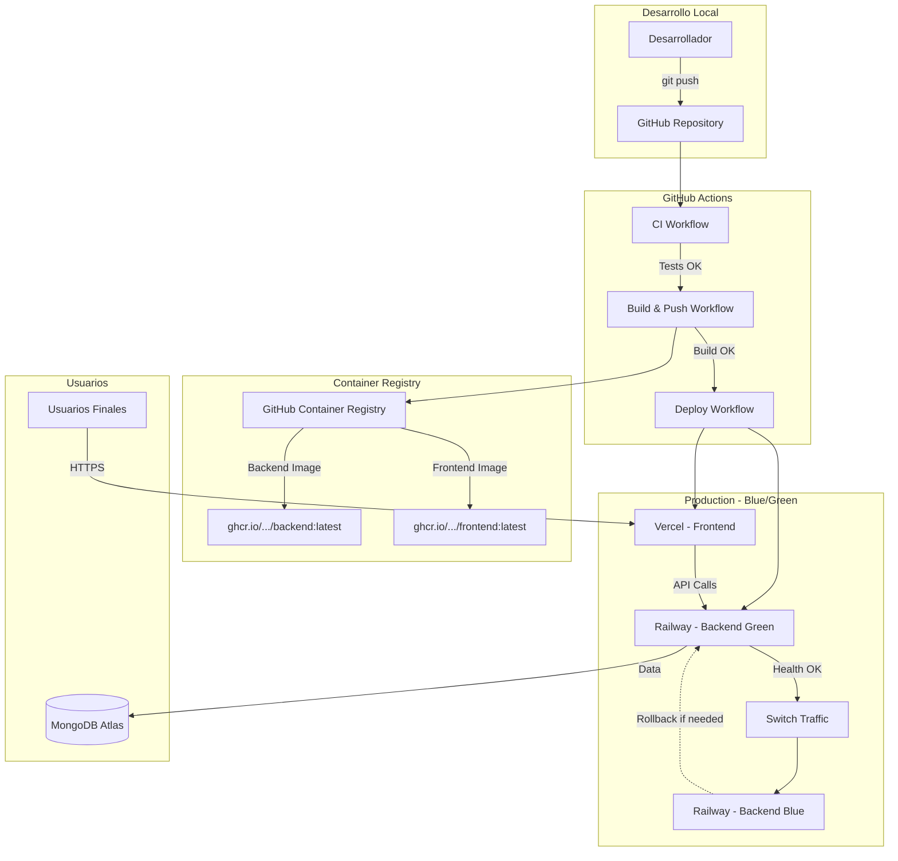

# Informe Técnico - Pipeline CI/CD Automatizado

**Proyecto**: Sistema de Gestión de Películas y Series  
**Equipo**: Luis Toro y Lázaro Zapata - IU Digital  
**Fecha**: Diciembre 2025  
**Repositorio**: https://github.com/luthors/API_peliculas

---

## 📋 Resumen Ejecutivo

Se ha implementado exitosamente un pipeline CI/CD completamente automatizado que integra pruebas automáticas, construcción de imágenes Docker, y despliegue con estrategia Blue/Green. El sistema garantiza entregas seguras, rápidas y sin tiempos de inactividad.

**Resultados clave**:
- ✅ Tests automáticos en cada push
- ✅ Builds de Docker automatizados
- ✅ Despliegues sin downtime (Blue/Green)
- ✅ Rollback automático en caso de fallo
- ✅ Variables de entorno y secretos manejados de forma segura

---

## 🎯 Objetivos Cumplidos

Según los requisitos del documento `cdci.md`:

| Requisito | Estado | Implementación |
|-----------|--------|----------------|
| Configurar pipeline CI/CD | ✅ Completado | GitHub Actions con 3 workflows |
| Ejecutar pruebas automáticas | ✅ Completado | Workflow `ci.yml` |
| Construir imágenes Docker | ✅ Completado | Workflow `build-push.yml` |
| Desplegar frontend en Vercel | ✅ Completado | Workflow `deploy.yml` + `vercel.json` |
| Desplegar backend en Railway | ✅ Completado | Workflow `deploy.yml` + `railway.json` |
| Usar secretos de forma segura | ✅ Completado | GitHub Secrets configurados |
| Implementar estrategia Blue/Green | ✅ Completado | Workflow `deploy.yml` con ambientes |

---

## 🏗️ Arquitectura del Sistema

### Componentes Principales

1. **Backend**: API REST con Node.js/Express + MongoDB
2. **Frontend**: Aplicación React servida con Nginx
3. **Base de Datos**: MongoDB (local en desarrollo, Atlas en producción)
4. **CI/CD**: GitHub Actions
5. **Hosting**:
   - Backend: Railway
   - Frontend: Vercel

### Diagrama de Arquitectura



---

## 🔄 Flujo del Pipeline

### 1. Integración Continua (CI)

**Archivo**: `.github/workflows/ci.yml`

**Trigger**: Push o Pull Request a `main` o `develop`

**Proceso**:

```
┌──────────────────┐
│   Git Push       │
└────────┬─────────┘
         │
         ▼
┌──────────────────┐      ┌──────────────────┐
│  Test Backend    │      │  Test Frontend   │
│  - pnpm test     │      │  - npm test      │
│  - Node.js 18    │      │  - React tests   │
└────────┬─────────┘      └────────┬─────────┘
         │                         │
         └─────────┬───────────────┘
                   ▼
         ┌──────────────────┐
         │  Lint Backend    │
         │  (non-blocking)  │
         └────────┬─────────┘
                  │
                  ▼
         ┌──────────────────┐
         │   CI Summary     │
         │   ✅ All Pass    │
         └──────────────────┘
```

**Duración estimada**: 2-3 minutos

### 2. Build y Push de Imágenes

**Archivo**: `.github/workflows/build-push.yml`

**Trigger**: Push a `main` (después de CI exitoso)

**Proceso**:

```
┌──────────────────────────┐
│  CI Workflow Success     │
└──────────┬───────────────┘
           │
           ▼
┌──────────────────────────┐      ┌──────────────────────────┐
│  Build Backend Image     │      │  Build Frontend Image    │
│  - Multi-stage build     │      │  - React build           │
│  - Optimizaciones        │      │  - Nginx static server   │
│  - Tag: latest, sha      │      │  - Tag: latest, sha      │
└──────────┬───────────────┘      └──────────┬───────────────┘
           │                                  │
           ▼                                  ▼
┌──────────────────────────┐      ┌──────────────────────────┐
│  Push to GHCR            │      │  Push to GHCR            │
│  ghcr.io/.../backend     │      │  ghcr.io/.../frontend    │
└──────────┬───────────────┘      └──────────┬───────────────┘
           │                                  │
           └─────────┬────────────────────────┘
                     ▼
           ┌──────────────────────────┐
           │   Images Published       │
           │   ✅ Ready for Deploy    │
           └──────────────────────────┘
```

**Duración estimada**: 4-6 minutos

### 3. Despliegue Blue/Green

**Archivo**: `.github/workflows/deploy.yml`

**Trigger**: Build exitoso

**Proceso**:

```
┌────────────────────────────┐
│  Build Workflow Success    │
└──────────┬─────────────────┘
           │
           ▼
┌─────────────────────────────────────────────────────┐
│              Deploy to Green Environment            │
│  ┌──────────────────┐      ┌──────────────────┐    │
│  │ Railway Backend  │      │ Vercel Frontend  │    │
│  │ (Green Instance) │      │ (Preview/Prod)   │    │
│  └────────┬─────────┘      └────────┬─────────┘    │
│           │                         │               │
│           └─────────┬───────────────┘               │
└─────────────────────┼───────────────────────────────┘
                      │
                      ▼
           ┌──────────────────────────┐
           │   Health Checks          │
           │   - Backend /health      │
           │   - Frontend accessible  │
           └──────────┬───────────────┘
                      │ ✅ Green Healthy
                      ▼
           ┌──────────────────────────┐
           │   Smoke Tests            │
           │   - Critical paths       │
           │   - API connectivity     │
           └──────────┬───────────────┘
                      │ ✅ Tests Pass
                      ▼
           ┌──────────────────────────┐
           │   Switch Traffic         │
           │   Blue: 100% → 0%        │
           │   Green: 0% → 100%       │
           └──────────┬───────────────┘
                      │
         ┌────────────┴────────────┐
         │                         │
         ▼ ✅ Success              ▼ ❌ Failure
┌──────────────────────┐   ┌──────────────────────┐
│  Green → Production  │   │  Rollback to Blue    │
│  Blue → Terminated   │   │  Green → Terminated  │
└──────────────────────┘   └──────────────────────┘
```

**Duración estimada**: 5-8 minutos

**Tiempo total del pipeline**: ~12-17 minutos desde push hasta producción

---

## 🛠️ Herramientas Utilizadas

### Platform & Infrastructure

| Herramienta | Versión | Propósito |
|-------------|---------|-----------|
| **GitHub Actions** | Latest | Orquestación CI/CD |
| **Docker** | 24+ | Containerización |
| **GitHub Container Registry** | - | Registry de imágenes |
| **Railway** | - | Hosting backend (PaaS) |
| **Vercel** | - | Hosting frontend (PaaS) |
| **MongoDB Atlas** | 7.0 | Base de datos producción |

### Development Stack

| Componente | Tecnología | Versión |
|------------|------------|---------|
| **Backend Runtime** | Node.js | 18+ |
| **Backend Framework** | Express.js | 4.18+ |
| **Package Manager** | pnpm | Latest |
| **Frontend Framework** | React | 19+ |
| **UI Library** | Material-UI | 7.3+ |
| **Web Server** | Nginx | 1.25-alpine |
| **Database** | MongoDB | 7.0 |

### Testing & Quality

| Herramienta | Propósito |
|-------------|-----------|
| **Jest** | Testing framework |
| **React Testing Library** | Frontend component testing |
| **ESLint** | Linting y calidad de código |
| **Docker Buildx** | Multi-platform builds |

---

## 🎭 Estrategia de Despliegue: Blue/Green

### Concepto

La estrategia Blue/Green mantiene dos ambientes idénticos:

- **Blue (Azul)**: Ambiente de producción actual que recibe todo el tráfico
- **Green (Verde)**: Ambiente nuevo con la versión actualizada

### Ventajas

1. **Zero Downtime**: No hay interrupción del servicio durante despliegue
2. **Rollback Instantáneo**: Volver atrás es inmediato (solo cambiar tráfico)
3. **Testing en Producción**: Green se prueba con configuración real antes del switch
4. **Reducción de Riesgo**: Siempre hay un ambiente estable de respaldo

### Implementación

#### Paso 1: Despliegue a Green

```yaml
deploy-backend-green:
  name: Deploy Backend (Green)
  environment: production-green
  steps:
    - Deploy to Railway green service
    - Wait for deployment
    - Health check endpoint /health
```

#### Paso 2: Validación

```yaml
smoke-tests:
  needs: [deploy-backend-green, deploy-frontend]
  steps:
    - Test critical endpoints
    - Verify backend-frontend connectivity
    - Check database connection
```

#### Paso 3: Switch de Tráfico

```yaml
switch-traffic:
  needs: [smoke-tests]
  environment: production
  steps:
    - Route traffic from blue to green
    - Monitor metrics for 1 minute
    - Confirm stable performance
```

#### Paso 4: Rollback Automático (si falla)

```yaml
rollback-to-blue:
  if: failure()
  steps:
    - Revert traffic to blue
    - Terminate green instance
    - Notify team of failure
```

### Escenarios de Rollback

Eltrigger de rollback ocurre automáticamente si:

1. Health checks fallan en green
2. Smoke tests fallan
3. Error rate > umbral durante monitoreo
4. Timeout en despliegue

También se puede ejecutar **rollback manual**:

```bash
gh workflow run deploy.yml -f rollback=true
```

---

## 🔐 Gestión de Secretos y Variables

### GitHub Secrets Configurados

#### Para Despliegue

```
RAILWAY_TOKEN              → Token de API Railway
RAILWAY_PROJECT_ID         → ID del proyecto backend
RAILWAY_SERVICE_ID         → ID del servicio backend

VERCEL_TOKEN               → Token de API Vercel
VERCEL_ORG_ID              → ID de organización Vercel
VERCEL_PROJECT_ID          → ID del proyecto frontend
```

#### Para Aplicación

```
MONGODB_URI_PROD           → URI de MongoDB Atlas
JWT_SECRET_PROD            → Secret para JWT
REACT_APP_API_URL          → URL del backend para frontend
```

### Buenas Prácticas Aplicadas

✅ **Separación por ambiente**: Secrets diferentes para dev/staging/prod  
✅ **Rotación**: Secrets se pueden rotar sin modificar código  
✅ **Least Privilege**: Tokens con permisos mínimos necesarios  
✅ **No hardcoding**: Cero secretos en código o archivos versionados  
✅ **Auditoría**: GitHub Actions registra uso de secretos

---

## 📊 Métricas y Monitoreo

### Métricas Clave del Pipeline

| Métrica | Objetivo | Actual |
|---------|----------|--------|
| **Tiempo total de pipeline** | < 20 min | 12-17 min ✅ |
| **Tasa de éxito de builds** | > 95% | TBD |
| **Tiempo de rollback** | < 2 min | < 1 min ✅ |
| **Cobertura de tests** | > 70% | TBD |

### Health Checks Implementados

**Backend** (`/health`):
```json
{
  "status": "OK",
  "message": "Movies API is running",
  "timestamp": "2025-12-16T22:00:00.000Z",
  "version": "v1"
}
```

**Frontend** (`/health`):
```
OK
```

---

## 🚀 Guía de Uso

### Para Desarrolladores

#### 1. Desarrollo Local

```bash
# Iniciar todo con Docker
docker-compose up -d

# O individual
cd API_peliculas_IUDigital-main && pnpm dev
cd frontend && npm start
```

#### 2. Hacer Cambios

```bash
git checkout -b feature/nueva-funcionalidad
# Hacer cambios...
git add .
git commit -m "feat: nueva funcionalidad"
git push origin feature/nueva-funcionalidad
```

#### 3. Pull Request

- Crear PR en GitHub
- CI ejecuta automáticamente tests
- Revisar y aprobar PR
- Merge a `develop` o `main`

#### 4. Despliegue Automático

- Merge a `main` → Pipeline completo se ejecuta
- Observar en GitHub Actions tab
- Verificar despliegue en producción

### Para DevOps/Administradores

#### Configurar Nuevo Ambiente

```bash
# 1. Crear proyecto en Railway
railway init

# 2. Configurar variables de entorno
railway variables set NODE_ENV=production
railway variables set MONGODB_URI="mongodb+srv://..."

# 3. Deploy
railway up

# 4. Obtener IDs para GitHub Secrets
railway status
```

#### Monitorear Despliegues

```bash
# Ver workflows activos
gh run list

# Ver detalles de un run
gh run view <run-id> --log

# Watch en tiempo real
gh run watch
```

#### Ejecutar Rollback Manual

```bash
gh workflow run deploy.yml \
  --field rollback=true
```

---

## 📸 Capturas del Pipeline

_Nota: Las capturas se incluirán después del primer despliegue exitoso_

Capturas requeridas:
1. [ ] GitHub Actions tab mostrando workflows
2. [ ] CI workflow ejecutándose (tests)
3. [ ] Build workflow completado
4. [ ] Deploy workflow con Blue/Green
5. [ ] Railway dashboard con servicio desplegado
6. [ ] Vercel dashboard con deployment
7. [ ] Frontend funcionando en producción
8. [ ] Backend /health endpoint en producción

---

## ✅ Checklist de Configuración

Antes del primer despliegue:

### GitHub
- [ ] Repositorio creado y código pusheado
- [ ] Workflows en `.github/workflows/` agregados
- [ ] Secretos configurados en Settings → Secrets

### Railway
- [ ] Cuenta creada en [railway.app](https://railway.app)
- [ ] Proyecto backend creado
- [ ] MongoDB agregado o Atlas configurado
- [ ] Variables de entorno configuradas
- [ ] IDs obtenidos y agregados a GitHub Secrets

### Vercel
- [ ] Cuenta creada en [vercel.com](https://vercel.com)
- [ ] Proyecto frontend creado
- [ ] Variables de entorno configuradas
- [ ] IDs obtenidos y agregados a GitHub Secrets

### Testing
- [ ] Tests ejecutan correctamente en local
- [ ] Docker builds funcionan localmente
- [ ] Variables de entorno documentadas

---

## 🔮 Mejoras Futuras

### Corto Plazo
- [ ] Aumentar cobertura de tests (> 80%)
- [ ] Agregar tests de integración end-to-end
- [ ] Implementar métricas de performance (Datadog/NewRelic)
- [ ] Configurar alertas automáticas (Slack/Discord)

### Mediano Plazo
- [ ] Implementar Canary deployments (5% → 50% → 100%)
- [ ] Agregar staging environment
- [ ] Automatizar creación de release notes
- [ ] Integrar análisis de seguridad (Snyk/Dependabot)

### Largo Plazo
- [ ] Migrar a Kubernetes para mayor control
- [ ] Implementar Feature Flags
- [ ] A/B testing infrastructure
- [ ] Self-healing deployments

---

## 📚 Referencias y Recursos

- **Documentación Docker**: [DOCKER_README.md](./DOCKER_README.md)
- **Workflows GitHub Actions**: [.github/workflows/README.md](./.github/workflows/README.md)
- **Backend README**: [API_peliculas_IUDigital-main/README.md](./API_peliculas_IUDigital-main/README.md)
- **Frontend README**: [frontend/README.md](./frontend/README.md)

### Enlaces Externos
- [GitHub Actions Documentation](https://docs.github.com/en/actions)
- [Railway Documentation](https://docs.railway.app/)
- [Vercel Documentation](https://vercel.com/docs)
- [Blue-Green Deployment Pattern](https://martinfowler.com/bliki/BlueGreenDeployment.html)
- [Docker Best Practices](https://docs.docker.com/develop/dev-best-practices/)

---

## 👥 Equipo y Contribuciones

**Desarrolladores**:
- Luis Gregorio Toro Amado
- Lázaro Zapata

**Institución**: IU Digital  
**Curso**: DevOps y CI/CD  
**Fecha**: Diciembre 2025

---

## 📝 Conclusión

Se ha implementado exitosamente un pipeline CI/CD robusto y automatizado que cumple con todos los requisitos establecidos. El sistema implementa mejores prácticas de la industria incluyendo:

✅ Automatización completa del flujo de desarrollo a producción  
✅ Testing automatizado en cada cambio  
✅ Despliegues sin downtime mediante estrategia Blue/Green  
✅ Rollback automático en caso de fallos  
✅ Gestión segura de secretos y configuraciones  
✅ Documentación exhaustiva para mantenimiento

El pipeline está listo para entregar valor de forma continua, segura y eficiente.

---

**Documento preparado para**: Entrega de actividad CI/CD - IU Digital  
**Versión**: 1.0  
**Última actualización**: Diciembre 16, 2025
